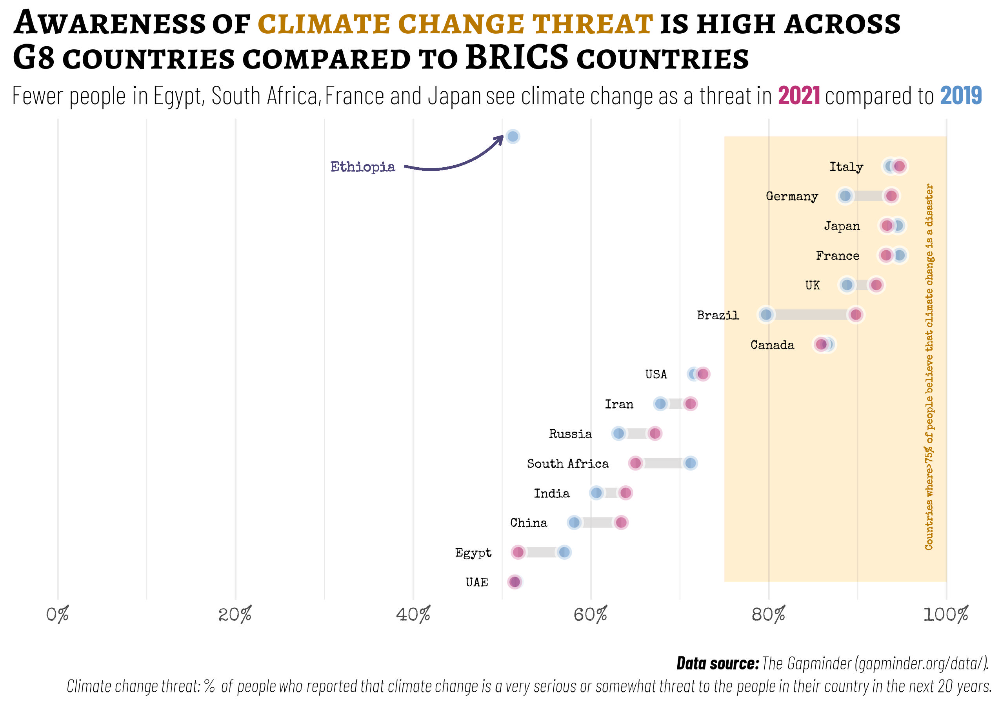

```{r setup, include=FALSE}
library (learnr)
library (gradethis)
library (dplyr)
library (readr)
library (ggplot2)
library (tidyr)

library (showtext)
library (extrafont)
library (ggtext)


font_add_google("Barlow Condensed", 
                family = "barlow",
                regular.wt = 200)

font_add_google("Special Elite", 
                family = "special")

font_add_google("Alegreya SC", 
                family = "alegreya_sc")


climate <- read_csv("../../02-data/climate_change.csv") %>% 
            pivot_longer(cols = `2019`:`2021`,
                         values_to = "climate_change",
                         names_to = "year")


co2_pcap <- read_csv("../../02-data/co2_pcap.csv") %>% 
            mutate_at(.vars = vars(`1800`:`2022`), 
                      .funs = ~as.numeric(.)) %>% 
            pivot_longer(cols = `1800`:`2022`,
                         values_to = "co2_pcapita",
                         names_to = "year")

lfp <- read_csv("../../02-data/lfp.csv") %>% 
       pivot_longer(cols = `1990`:`2019`,
                   values_to = "labour_fp",
                   names_to = "year")
  
sanitation <- read_csv("../../02-data/sanitation.csv") %>% 
              pivot_longer(cols = `2000`:`2022`,
                           values_to = "sanitation",
                           names_to = "year")
              
 
study_dta <-  climate %>% 
              full_join(., co2_pcap,
                        by = c("country", "year")) %>% 
              full_join(., sanitation,
                        by = c("country", "year")) %>% 
              full_join(., lfp,
                        by = c("country", "year")) %>% 
              filter (year >= 2000)
                           
              
tutorial_options(
  exercise.cap = "Console",
  exercise.checker = gradethis::grade_learnr
)
knitr::opts_chunk$set(error = TRUE)
```


## Welcome

### 

The practical exercises on this page are designed to help you develop advanced skills in creating well-designed and informative graphics with free, open-source statistical analysis software like R/RStudio. 


:::::: {.cols data-latex=""}

::: {.col data-latex="{0.5\textwidth}"}

In this practical exercise, you will apply your knowledge of how to customize `ggplot2` graphics. 

Specifically, you will learn to :

* map data → aesthetics → graphics
* create a ggplot graphic using the relevant `geom_`
* add layers to a ggplot graphic as necessary
* load and import Google fonts into an R session
* specify and change color related aesthetics
* modify components of a theme

Before taking this week's practical exercise, please make sure that you are already familiar with <a href="http://iteachr.shinyapps.io/ggplot_basics/" target="_blank">**`ggplot` basic**</a>.

You can also read this chapter on [Getting Started with ggplot2](http://doi.org/10.1007/978-3-319-24277-4_2) for additional support.


:::

::: {.col data-latex="{0.15\textwidth}"}
\ 
\ 
<!-- an empty Div (with a white space), serving as
a column separator -->
:::

::: {.col data-latex="{0.35\textwidth}"}

<br>
<br>

:::

::::::

### Prerequisites

I've installed and pre-loaded the following r-packages📦 for this tutorial:

```{r eval = FALSE}
library (readr)
library (ggplot2)
library (dplyr)
library (tidyr)
```


To practice these skills, we will use global data aggregated by <a href="https://www.gapminder.org/" target="_blank">Gapminder</a>-an independent Swedish foundation that fights devastating misconceptions and promotes a fact-based worldview everyone can understand. The Gapminder <a href="https://www.gapminder.org/data/" target="_blank">data page</a> includes data on various indicators that have been inherited from Gapminder World, compiled manually as well as those that are direct copy from the World Bank.

For this practice exercise, I have already downloaded data on some of these indicators for you and stored them in a data folder in our online working directory. These includes data on:

- `climate change`: This measures the % of people who says that climate change is a very serious or somewhat threat when asked  the following question in the Gallup World Poll: *"Do you think that climate change is a very serious threat, a somewhat serious threat, or not a threat at all to the people in this country in the next 20 years?"*. Additional information can be found <a href="https://gapm.io/dclimate-change-perception" target="_blank">here</a>


- `Environmental polution`: This measures Carbondioxide emissions per capita Consumption based, tonnes per capita. Additional information can be found <a href="http://gapm.io/dco2_consumption_historic" target="_blank">here</a>


- `Labour force`: The labour force participation rate measures the percentage of all labour to the total population of working-aged people (15-64 years). Additional information can be found <a href="https://www.ilo.org/ilostat/" target="_blank">here</a>.


- `Sanitation`: The percentage of people using at least basic sanitation services, that is, improved sanitation facilities that are not shared with other households. This indicator encompasses both people using basic sanitation services as well as those using safely managed sanitation services. Improved sanitation facilities include flush/pour flush to piped sewer systems, septic tanks or pit latrines; ventilated improved pit latrines, compositing toilets or pit latrines with slabs. Additional information can be found <a href="https://data.worldbank.org/indicator/SH.STA.ACSN" target="_blank">here</a>.


I have also preloaded each one of these data sets for you. Data on climate change is stored as `climate`, environmental pollution stored as `co2_pcap`, labour force data stored as `lfp` and sanitation stored as `sanitation`. I also cleaned the data (using the tidy principles) and merged them into a single data file that has been stored as `study_dta`.

If you are ready to begin, click on!


## Intermediate data visualization with `ggplot2`

### Looking ahead

In the previous lecture, we have covered some of the ways in which you can visualise patterns in a quantitative data. In this exercise, we will build on the skills you have acquired in Topic 2 to create a Dumbbell chart to visualize changes in the percentage of adults who says that climate change is a very serious or somewhat threat.

<br>

{width="100%"}

```{r eval=FALSE, fig.align='center', fig.height=5.5, fig.showtext=TRUE, fig.width=8.5, message=FALSE, warning=FALSE, include=FALSE}

library (showtext)
library (extrafont)
library (ggtext)


font_add_google("Barlow Condensed", 
                family = "barlow",
                regular.wt = 200)

font_add_google("Special Elite", 
                family = "special")

font_add_google("Alegreya SC", 
                family = "alegreya_sc")


graph_dta <-  study_dta %>% 
              mutate (year = as.numeric(year)) %>% 
              filter (year >= 2000) %>% 
              filter (!is.na(climate_change)) %>% 
              filter (country == "Brazil" |
                        country == "Russia" |
                        country == "India" |
                        country == "China" |
                        country == "Egypt" |
                        country == "Ethiopia" |
                        country == "Iran" |
                        country == "UAE" |
                        country == "South Africa" |
                        country == "USA" |
                        country == "Italy" |
                        country == "Japan" |
                        country == "UK" |
                        country == "Canada" |
                        country == "France" |
                        country == "Germany")


graph_dta %>% 
  select (country, year,
          climate_change) %>% 
  pivot_wider(names_from = year,
              values_from = climate_change) %>%
  ggplot () +
  geom_rect(aes(ymin = "UAE",
                ymax = "Ethiopia"),
              xmin = 75, xmax = 100,
              fill = "#ffa600", 
            alpha = 0.01) +
  geom_segment(aes(y = reorder(country,
                               `2021`),
                   yend = reorder(country,
                               `2021`),
                   x = `2019`,
                   xend = `2021`),
               linewidth=3,
               color = "#D4d2d3",
               alpha = 0.7) +
  geom_point (aes(y = reorder(country,
                               `2021`),
                  x = `2019`),
              size = 3,
              stroke = 2,
              shape = 21,
              color = "white",
              alpha = 0.6,
              fill = "#5a91ca") +
  geom_point (aes(y = reorder(country,
                               `2021`),
                  x = `2021`),
              size = 3,
              stroke = 2,
              shape = 21,
              color = "white",
              fill = "#bd3175",
              alpha = 0.6) +
  geom_text(aes(x = if_else(`2021` > `2019`,
                           `2019` - 3,
                           `2021` - 3,
                           missing = `2021` + 1),
                y = reorder(country,
                            `2021`),
                label = country,
                hjust = 1),
                size = 3.6,
            family = "special") +
  geom_text(x = 98, y = "USA",
            label = 'Countries where>75% of people believe that climate change is a disaster ',
            angle = 90,
            hjust = 0.48,
            size = 2.0, color = "#b97800",
            family = "special") +
  geom_curve( x = 39, # Play around with the coordinates until you're satisfied
              y = "Italy",
              yend = "Ethiopia",
              xend = 50, color = "#4d467a",
              linewidth = 0.7,
              curvature = 0.3,
              arrow = arrow(length = unit(0.2, 'cm'))
  ) +
  geom_text(x = 38, y = "Italy",
          label = 'Ethiopia',
          hjust = 1,
          size = 4.0, color = "#4d467a",
          family = "special") +

  scale_x_continuous(limits = c(0,100),
                     breaks = seq(0,100,20),
                     labels = function(x) paste0(x, "%")) +
  labs (title = "Awareness of <span style = 'color:#b97800;'>climate change threat</span> is high across <br>G8 countries compared to BRICS countries",
        subtitle = "Fewer people in Egypt, South Africa, France and Japan see climate change as a threat in <span style = 'color:#bd3175;'>**2021**</span> compared to <span style = 'color:#5a91ca;'>**2019**</span>",
        caption = "<br><strong>Data source:</strong> The Gapminder (gapminder.org/data/). <br>Climate change threat: % of people who reported that climate change is a very serious or somewhat threat to the people in their country in the next 20 years.") +
  theme_minimal() +
  theme (axis.text.x = element_text(size = 8,
                                    family = "special"),
         axis.title = element_blank(),
         axis.text.y  = element_blank(),
         panel.grid.major.y = element_blank(),
         plot.title = element_markdown(hjust = 0,
                                      family = "alegreya_sc",
                                      face = "bold",
                                      lineheight = unit(0.8, "pt"),
                                      size = 23),
         plot.subtitle = element_markdown(hjust = 0,
                                      family = "barlow",
                                      lineheight = unit(1.2, "pt"),
                                      size = 15),
         plot.caption = element_markdown(hjust = 1, 
                                     size = 12,
                                     family = "barlow",
                                     face = "italic",
                                     lineheight = unit(0.8, "pt"))) 
  
#   theme_minimal() +
#   theme (legend.position = "none",
#          axis.text.x = element_text(size = 35,
#                                     family = "special"),
#          axis.title = element_blank(),
#          axis.text.y  = element_blank(),
#          panel.grid.major.y = element_blank(),
#          plot.title = element_markdown(hjust = 0,
#                                       family = "alegreya_sc",
#                                       face = "bold",
#                                       lineheight = unit(0.3, "pt"),
#                                       size = 72),
#          plot.subtitle = element_markdown(hjust = 0,
#                                       family = "barlow",
#                                       lineheight = unit(1.2, "pt"),
#                                       size = 50),
#          plot.caption = element_markdown(hjust = 1, 
#                                      size = 35,
#                                      family = "barlow",
#                                      face = "italic",
#                                      lineheight = unit(0.4, "pt"))) 
# 
# ggsave("www/ggplot_reg.jpg",
#        height =6.0, 
#        width=8.5,
#        dpi = 300)

```


```{r intro-quiz1, echo=FALSE}
question("How confident are you in your ability to create the above visualization?",
  answer("Very confident! Let's do it", correct = TRUE),
  answer("Not so confident!"),
  correct = "Awesome, Let's do it.",
  incorrect = "Fret not. I am here to will walk you through, step-by-step.",
  allow_retry = FALSE
)
```


### 

I have already cleaned and restructured the data in a format desirable for our data visualisation. Next, we will begin developing the layers for our graphic. Our goal is to create a ggplot layer and add a segment layer to the graph. Your line segment graph should show the percentage change (between 2019 and 2021) in adults who believe that climate change is a threat across the BRICS and G8 countries.

You would note that `geom_segment()` takes two values for each of x (x and xend) and y-axis (y and yend). For the y-axis we have kept the values the same for both y and yend. However, for the x-axis you need to map the percentage of adults who see climate change as a threat for each year to one of x and xend. I have already pre-filled the code chunk for you below. Your task is to replace the blanks with the correct values.

```{r vis_ex1-setup}

graph_dta <-  study_dta %>% 
              mutate (year = as.numeric(year)) %>% 
              filter (year >= 2000) %>% 
              filter (!is.na(climate_change)) %>% 
              select (country, year,
                      climate_change) %>% 
              pivot_wider(names_from = year,
                          values_from = climate_change) %>% 
              filter (country == "Brazil" |
                        country == "Russia" |
                        country == "India" |
                        country == "China" |
                        country == "Egypt" |
                        country == "Ethiopia" |
                        country == "Iran" |
                        country == "UAE" |
                        country == "South Africa" |
                        country == "USA" |
                        country == "Italy" |
                        country == "Japan" |
                        country == "UK" |
                        country == "Canada" |
                        country == "France" |
                        country == "Germany")

```


```{r vis_ex1, exercise = TRUE, fig.align='center', fig.height=5.5, fig.width=8.5, exercise.eval = FALSE}
graph_dta %>% 
  ggplot () +
  geom_segment(aes(y = country, yend = country,
                   x = ___, xend = ___))
```


<div id="vis_ex1-hint">
**Hint:** Have you mapped the correct variable names to the correct aesthetics?<br>To map column names with numeric values, you'll need to put the values between two backticks. E.g *`2012`* instead of ~2012~.
</div>


### 

Excellent work!. Now let's customize the line segment graph even further. We will change the color and increase the thickness and transparency of the lines. I have already pre-filled parts of the code for you. Your new task is to replace the blanks by increasing the ***thickness*** of the lines to 3 and the **transparency to 0.7**.

```{r vis_ex2, exercise = TRUE, fig.align='center', fig.height=5.5, fig.width=8.5, exercise.eval = FALSE, exercise.setup="vis_ex1-setup"}
graph_dta %>% 
  ggplot () +
  geom_segment(aes(y = country, yend = country,
                   x = `2019`, xend = `2021`),
               color = "#D4d2d3",
               ___ = ___,
               ___ = 0.7)
```


<div id="vis_ex2-hint">
**Hint:** Have you mapped the correct values to the right aesthetics?
</div>


### 

We are getting there! You might have observed that the line segments are not well ordered in the previous graphic. We can reorder them especially on the y-axis to make this graphic more visually appealing and information.

You have learnt in the lecture that there is a function that you can use to re-order values on the y-axis. Your next exercise is to use that function to re-order values on the y-axis based on the % of adults who see climate change as a threat in 2021.

```{r vis_ex3, exercise = TRUE, fig.align='center', fig.height=5.5, fig.width=8.5, exercise.eval = FALSE, exercise.setup="vis_ex1-setup"}
graph_dta %>% 
  ggplot () +
  geom_segment(aes(y = ___(country, ___),
                   yend = ___(country, ___),
                   x = `2019`, xend = `2021`),
               linewidth=3,
               color = "#D4d2d3",
               alpha = 0.7)
```


<div id="vis_ex3-hint">
**Hint:** Have you mapped the correct variable names to the correct aesthetics? <br>Are you using the right function to reorder values on the y-axis.
</div>


### 

Awesome! We have a visually appealing line-segment graph. Next, we will add a point layer to our graphic using `geom_point()`. The point layer should show the percentage of adults who see climate change as a threat in 2019. Your next task is to replace blanks in the following code chunk with the right values.

```{r vis_ex4, exercise = TRUE, exercise.eval = FALSE, fig.align='center', fig.height=5.5, fig.width=8.5, exercise.setup="vis_ex1-setup"}
graph_dta %>% 
  ggplot () +
  geom_segment(aes(y = reorder(country, `2021`),
                   yend = reorder(country, `2021`),
                   x = `2019`, xend = `2021`),
               linewidth=3, color = "#D4d2d3",
               alpha = 0.7) +
  geom_point (aes(y = ___, x = ___))
```


<div id="vis_ex4-hint">
**Hint:** Have you mapped the correct variable names to the correct aesthetics? <br> Have you reordered the y-axis values in the new layer?
</div>

### 

This is looking good, isn't it? Your next task is to increase the size of the points to 3pt. Because of the likelihood of overlapping points with 2021, we will adjust the transparency of the points to 0.6.  Your task is to replace the blanks with the correct arguments to make these changes.

```{r vis_ex5, exercise = TRUE, exercise.eval = FALSE, fig.align='center', fig.height=5.5, fig.width=8.5, exercise.setup="vis_ex1-setup"}
graph_dta %>% 
  ggplot () +
  geom_segment(aes(y = reorder(country, `2021`),
                   yend = reorder(country, `2021`),
                   x = `2019`, xend = `2021`),
               linewidth=3, color = "#D4d2d3",
               alpha = 0.7) +
  geom_point (aes(y = ____, x = ___),
              ___ = 3, ___ = 0.6)
```


<div id="vis_ex5-hint">
**Hint:** Have you mapped the values to the correct aesthetics/arguments?
</div>

### 

Let's tweak the points even further. We will change the shape/style of the points as well as the thickness of the outline of the point. The point style should be 21 so that we can adjust the fill and outline colors. We also need to change the thickness of the outline of the points to 2 so that they are more visible in the plots. Lastly, we will change the fill color to blue ("#5a91ca") and the outline color to white ('white'). I have already pre-filled parts of the code for you in the chunk below. Your task is to replace the blanks with the correct arguments and values.

```{r vis_ex6, exercise = TRUE, fig.align='center', fig.height=5.5, fig.width=8.5, exercise.eval = FALSE, exercise.setup="vis_ex1-setup"}
graph_dta %>% 
  ggplot () +
  geom_segment(aes(y = reorder(country, `2021`),
                   yend = reorder(country, `2021`),
                   x = `2019`, xend = `2021`),
               linewidth=3, color = "#D4d2d3",
               alpha = 0.7) +
  geom_point (aes(y = reorder(country, `2021`), x = `2019`),
              size = 3, ___ = 0.6,
              ___ = 21, stroke = 2,
              ___ = "white", ___ = "#5a91ca")
```

<div id="vis_ex6-hint">
**Hint:** Have you mapped the values to the correct aesthetics/arguments?
</div>


### 

You may have observed that values for the y-argument is the same for both plotting layers (line-segment and point). Rather than repeating the same argument on multiple layers, we can do this more efficiently by moving the y-aesthetic to the base layer in `ggplot()`. See the code structure below.

```{r vis_tst, exercise = TRUE, fig.align='center', fig.height=5.5, fig.width=8.5, echo = FALSE, exercise.setup="vis_ex1-setup"}
graph_dta %>% 
  ggplot (aes(y = reorder(country, `2021`))) +
  geom_segment(aes(yend = reorder(country, `2021`),
                   x = `2019`, xend = `2021`),
               linewidth=3, color = "#D4d2d3",
               alpha = 0.7) +
  geom_point (aes(x = `2019`),
              size = 3, alpha = 0.6,
              shape = 21, stroke = 2,
              color = "white", fill = "#5a91ca")
```

In the previous challenge, you have added a point layer for the  % of people that see climate change as a threat in 2019. We need to also do the same for the year 2021. Your next task is to add another point layer to our graph. We will follow the same logic as 2019 but with a different fill color. I have already added this new plotting layer for you and your task is to replace the blanks in the code chunk below. You should also remember to keep aesthetics that are repeated across layers in `ggplot()`.

```{r vis_ex7, exercise = TRUE, fig.align='center', fig.height=5.5, fig.width=8.5, exercise.eval = FALSE, exercise.setup="vis_ex1-setup"}
graph_dta %>% 
  ggplot () +
  geom_segment(aes(y = reorder(country, `2021`),
                   yend = reorder(country, `2021`),
                   x = `2019`, xend = `2021`),
               linewidth=3, color = "#D4d2d3",
               alpha = 0.7) +
  geom_point (aes(y = reorder(country, `2021`), x = `2019`),
              size = 3, alpha = 0.6,
              ___ = 21, ___ = 2,
              color = "white", fill = "#5a91ca") +
  geom_point (aes(___),
              size = 3, alpha = 0.6,
              ___ = 21, ___ = 2,
              color = "white", fill = "#bd3175")
```

<div id="vis_ex7-hint">
**Hint:** Have you moved the y-aesthetic to the base layer?
</div>

###

The graph is gradually looking great. The next step is for us to add a rectangular layer to our plot to highlight countries where more than 80% of the people see climate change as a serious threat. We can do this by using `geom_rect` which takes the following arguments: `xmin`, `ymin`, `xmax`, `ymax`, in addition to other well known arguments.

I have pre-filled parts of the code for you and your next task is to replace the blanks. Since you we are drawing a rectangle from the lower part of the graph to the upper part, you'll need to specify map the countries on the lower and upper end of the graph to ymin and ymax respectively. For the width of the rectangle, we are only interested in shading the areas above 80%, that is, 80%-100%. 

```{r vis_ex8, exercise = TRUE, fig.align='center', fig.height=5.5, fig.width=8.5, exercise.eval = FALSE, exercise.setup="vis_ex1-setup"}
graph_dta %>% 
  ggplot (aes(y = reorder(country, `2021`))) +
  geom_segment(aes(yend = reorder(country, `2021`),
                   x = `2019`, xend = `2021`),
               linewidth=3, color = "#D4d2d3",
               alpha = 0.7) +
  geom_point (aes(x = `2019`),
              size = 3, alpha = 0.6,
              shape = 21, stroke = 2,
              color = "white", fill = "#5a91ca") +
  geom_point (aes(x = `2021`),
              size = 3, alpha = 0.6,
              shape = 21, stroke = 2,
              color = "white", fill = "#bd3175") +
  geom_rect(aes(ymin = ___,
                ymax = ___),
              ___ = 75, ___ = 100,
              fill = "#ffa600")
```

<div id="vis_ex8-hint">
**Hint:** Have you mapped the values to the correct aesthetics?
</div>


###

You would notice that the orange rectangle is overshadowing other layers in the graph. We can fix this by switching the position of the rectangular layer either before the point layers, or before the line-segment layer. Your task is to find a suitable position for the rectangular layer and position appropriately. Lastly, you will need to reduce the color intensity of the rectangle. We can achieve this by setting the transparency of the rectangle to 0.01. 

```{r vis_ex9, exercise = TRUE, fig.align='center', fig.height=5.5, fig.width=8.5, exercise.eval = FALSE, exercise.setup="vis_ex1-setup"}
graph_dta %>% 
  ggplot (aes(y = reorder(country, `2021`))) +
  geom_segment(aes(yend = reorder(country, `2021`),
                   x = `2019`, xend = `2021`),
               linewidth=3, color = "#D4d2d3",
               alpha = 0.7) +
  geom_point (aes(x = `2019`),
              size = 3, alpha = 0.6,
              shape = 21, stroke = 2,
              color = "white", fill = "#5a91ca") +
  geom_point (aes(x = `2021`),
              size = 3, alpha = 0.6,
              shape = 21, stroke = 2,
              color = "white", fill = "#bd3175") +
  geom_rect(aes(ymin = "UAE",
                ymax = "Ethiopia"),
              xmin = 75, xmax = 100,
              fill = "#ffa600") 
```


<div id="vis_ex9-hint">
**Hint:** Have you mapped the correct variable names to the correct aesthetics?
</div>


###

Excellent work. Now, our base graphic layer is ready. Let's assign this graphic to an image object that we can call subsequently to add more layers. Your next task, is to assign the code chunk below to an object `bell_chart`.

```{r vis_ex10, exercise = TRUE, fig.align='center', fig.height=5.5, fig.width=8.5, exercise.eval = FALSE, exercise.setup="vis_ex1-setup"}
___ graph_dta %>% 
              ggplot (aes(y = reorder(country, `2021`))) +
              geom_rect(aes(ymin = "UAE", ymax = "Ethiopia"),
                        xmin = 75, xmax = 100,
                        fill = "#ffa600", alpha = 0.01) +
              geom_segment(aes(yend = reorder(country, `2021`),
                               x = `2019`, xend = `2021`),
                           linewidth=3, color = "#D4d2d3",
                           alpha = 0.7) +
              geom_point (aes(x = `2019`),
                          size = 3, stroke = 2,
                          alpha = 0.6, shape = 21,
                          color = "white", fill = "#5a91ca") +
              geom_point (aes(x = `2021`),
                          size = 3, alpha = 0.6,
                          stroke = 2, shape = 21,
                          color = "white", fill = "#bd3175")

bell_chart
```


<div id="vis_ex10-hint">
**Hint:** <br> Have you moved the rectangular layer before the line segment and assigned the graphics object to bell_chart?
</div>


###

You would notice in our sample graph that the countries are positioned next to each dumb bell. We can achieve this with `geom_text()`. On the y-axis, we will map the ordered countries, and on the x-axis, we will map the percentage of people who see climate change as a threat in 2019 or 2021 (whichever is lower) minus **three**. Remember that we don't have to specify the y-axis aesthetic in this layer because we have already added it to the base layer in the previous code chunk. 

Beside the positions, we also need to map countries to the label aesthetic. Lastly, we need to right-align the labels and set the font size as 3.6. I have already pre-specified the text layer for you in the code chunk below. Your task is to replace blanks with the right aesthetic and value.


```{r vis_ex11-setup, exercise.setup="vis_ex1-setup"}

bell_chart <- graph_dta %>% 
              ggplot (aes(y = reorder(country, `2021`))) +
              geom_rect(aes(ymin = "UAE", ymax = "Ethiopia"),
                        xmin = 75, xmax = 100,
                        fill = "#ffa600", alpha = 0.01) +
              geom_segment(aes(yend = reorder(country, `2021`),
                               x = `2019`, xend = `2021`),
                           linewidth=3, color = "#D4d2d3",
                           alpha = 0.7) +
              geom_point (aes(x = `2019`),
                          size = 3, stroke = 2,
                          alpha = 0.6, shape = 21,
                          color = "white", fill = "#5a91ca") +
              geom_point (aes(x = `2021`),
                          size = 3, alpha = 0.6,
                          stroke = 2, shape = 21,
                          color = "white", fill = "#bd3175")

```

```{r vis_ex11, exercise = TRUE, fig.showtext=TRUE, fig.align='center', fig.height=5.5, fig.width=8.5, exercise.eval = FALSE}

bell_chart_1 <- bell_chart +
                geom_text(aes(x = ifelse(`2021` > `2019`,
                                         `2019` - 3,
                                         `2021` - 3),
                              ___ = country),
                          hjust = ___, size = 3.6)

bell_chart_1
```

<div id="vis_ex11-hint">
**Hint:** Have you mapped the correct variable names to the correct aesthetics?
</div>


###

We have now added a text layer to our graphic but we can make the text more visually appealing by changing the font family to "special".


```{r vis_ex11_a, exercise = TRUE, fig.showtext=TRUE, fig.align='center', fig.height=5.5, fig.width=8.5, exercise.eval = FALSE, exercise.setup="vis_ex11-setup"}

bell_chart_1 <- bell_chart +
                geom_text(aes(x = ifelse(`2021` > `2019`,
                                         `2019` - 3,
                                         `2021` - 3),
                              ___ = country),
                          hjust = ___, size = 3.6,
                          ___ = "special")

bell_chart_1
```

<div id="vis_ex11_a-hint">
**Hint:** Have you specified the right argument/aesthetic for changing font family.
</div>


###

You would notice that font style (special) wasn't rendered. That's because we have not loaded the font into our working session. To do that, we will need to install some packages (`showtext`, `extrafont`, `ggtext`), load the libraries, import the fonts to our R-workspace, and initiate a font renderer.

Let's take this step-by-step. We will need to load the necessary pacakges. I have already installed them for you.


```{r vis_ex12, exercise = TRUE, fig.showtext=TRUE, fig.align='center', fig.height=5.5, fig.width=8.5, exercise.eval = FALSE, exercise.setup="vis_ex11-setup"}

```

<div id="vis_ex12-hint">
**Hint:** <br> Have you load the libraries in the right order: `showtext`, `extrafont`, `ggtext`?
</div>


###

Below I have loaded the required font from Google using `font_add_google()`:


```{r vis_ex13, exercise = TRUE, fig.showtext=TRUE, fig.align='center', fig.height=5.5, fig.width=8.5, exercise.eval = FALSE, exercise.setup="vis_ex11-setup"}

font_add_google("Barlow Condensed", 
                family = "barlow",
                regular.wt = 200)

font_add_google("Special Elite", 
                family = "special")

font_add_google("Alegreya SC", 
                family = "alegreya_sc")

```

<div id="vis_ex13-hint">
**Hint:** <br> 
</div>


###

Next, we need to initiate showtext to render the text and graphics. Your next task is to use the appropriate function to initiate showtext.


```{r vis_ex14, exercise = TRUE, fig.showtext=TRUE, fig.align='center', fig.height=5.5, fig.width=8.5, exercise.eval = FALSE, exercise.setup="vis_ex11-setup"}
font_add_google("Barlow Condensed",
                regular.wt = 200, 
                family = "barlow")

font_add_google("Special Elite", 
                family = "special")

font_add_google("Alegreya SC", 
                family = "alegreya_sc")

___

```


<div id="vis_ex14-hint">
**Hint:** <br> Are you using the right function?
</div>


###

Now, let's do this again. You need to map countries to the label aesthetic, right-align the labels and set the font size as 5.5. Lastly, make the text label more visually appealing by changing the font family to "special".

```{r vis_ex15, exercise = TRUE, fig.showtext=TRUE, fig.align='center', fig.height=5.5, fig.width=8.5, exercise.eval = FALSE, exercise.setup="vis_ex11-setup"}

bell_chart_1 <- bell_chart +
                geom_text(aes(x = ifelse(`2021` > `2019`,
                                         `2019` - 3,
                                         `2021` - 3),
                              ___ = country),
                          hjust = ___, size = 3.6,
                          ___ = "special")

bell_chart_1

```

<div id="vis_ex15-hint">
**Hint:** Have you mapped the correct variable names to the correct aesthetics?
</div>

###

Next we will add another layer to the last image object we created: `bell_chart_1`. Your task is to add a text label to explain the shaded area. This text label can be positioned on the same line as USA, and at 98%. The text should also be center aligned (0.48), rotated at 90 with a 2 font size. Your next task is to replace the blanks with the appropriate values/argument.

```{r vis_ex16-setup, exercise.setup="vis_ex1-setup"}

bell_chart_1 <- graph_dta %>% 
                ggplot (aes(y = reorder(country, `2021`))) +
                geom_rect(aes(ymin = "UAE", ymax = "Ethiopia"),
                          xmin = 75, xmax = 100,
                          fill = "#ffa600", alpha = 0.01) +
                geom_segment(aes(yend = reorder(country, `2021`),
                                 x = `2019`, xend = `2021`),
                             linewidth=3, color = "#D4d2d3",
                             alpha = 0.7) +
                geom_point (aes(x = `2019`),
                            size = 3, stroke = 2,
                            alpha = 0.6, shape = 21,
                            color = "white", fill = "#5a91ca") +
                geom_point (aes(x = `2021`),
                            size = 3, alpha = 0.6,
                            stroke = 2, shape = 21,
                            color = "white", fill = "#bd3175") +
                  geom_text(aes(x = ifelse(`2021` > `2019`,
                                           `2019` - 3,
                                           `2021` - 3),
                                label = country),
                            hjust = 1, size = 3.6,
                            family = "special")
```


```{r vis_ex16, exercise = TRUE, fig.showtext=TRUE, fig.align='center', fig.height=5.5, fig.width=8.5, exercise.eval = FALSE}

bell_chart_2 <- bell_chart_1 +
                geom_text(___ = 98, ___ = "USA",
                          ___ = 'Countries where>75% of people believe that climate change is a disaster ',
                          ___ = 90, ___ = 0.48, ___ = 2,
                          color = "#b97800", family = "special")

bell_chart_2

```

<div id="vis_ex16-hint">
**Hint:** Have you mapped the values to the correct aesthetics? <br>You can rotate texts with `angle`<br> Horizontal alignment can be adjusted with `hjust`.
</div>

###

Excellent! You may have noticed that data points for all the countries have been labelled except for Ethiopia. This might make interpreting the plot difficult for readers and we can make address this by annotating the graph. 

Our next task, is to add a text layer to the graphic with the label "Ethiopia". The text should be positioned at 38% and on the same line as Italy. The text should be right aligned with size 4. I have already pre-filled the code chunk for you and your task is to replace the blanks with the appropriate argument/values.

```{r vis_ex17, exercise = TRUE, fig.showtext=TRUE, fig.align='center', fig.height=5.5, fig.width=8.5, exercise.eval = FALSE, exercise.setup="vis_ex16-setup"}

bell_chart_2 <- bell_chart_1 +
                geom_text(x = 98, y = "USA",
                          label = 'Countries where>75% of people believe that climate change is a disaster ',
                          angle = 90, hjust = 0.48, size = 2,
                          color = "#b97800", family = "special") +
                geom_text(___ = 38, ___ = "Italy",
                        ___ = 'Ethiopia',
                        ___ = 1,
                        size = 4, ___ = "#4d467a",
                        ___ = "special")

bell_chart_2
```

<div id="vis_ex17-hint">
**Hint:** Have you mapped the values to the correct aesthetics? <br>Texts can be colored with the `color` argument not `fill`.
</div>


###

Great job! We have now added a text layer but it may still be add to link the text to the point. We can also address this by adding a curved layer to graphic. `geom_curve()` allows us to add a curved layer to a graphic by taking the following arguments: x, xend, y, yend alongside all other arguments that you are already familiar with.

The curved line should be positioned between Italy and Ethiopia on the y-axis and should go from 39-50% on the x-axis. We can also adjust the width of the line (0.7). We can also add an arrow to the curved line using the arrow argument. Your task is to replace the blanks with the appropriate value and you are also free to play around with the values. 


```{r vis_ex18, exercise = TRUE, fig.showtext=TRUE, fig.align='center', fig.height=5.5, fig.width=8.5, exercise.eval = FALSE, exercise.setup="vis_ex16-setup"}

bell_chart_2 <- bell_chart_1 +
                geom_text(x = 98, y = "USA",
                          label = 'Countries where>75% of people believe that climate change is a disaster ',
                          angle = 90, hjust = 0.48, size = 2,
                          color = "#b97800", family = "special") +
                geom_text(x = 38, y = "Italy",
                        label = 'Ethiopia',
                        hjust = 1,
                        size = 4, color = "#4d467a",
                        family = "special") +
                geom_curve(___ = "Italy", ___ = "Ethiopia",
                           ___ = 39, ___ = 50, 
                           color = "#4d467a", ___ = 0.7, curvature = 0.3, 
                           arrow = arrow(length = unit(0.2, 'cm')))
                
bell_chart_2

```

<div id="vis_ex18-hint">
**Hint:** Have you mapped the values to the correct aesthetics?
</div>


###

You are probably looking forward to the end already. Don't worry we are almost there. 

You might have also noticed that our x-axis starts at ~50%, primarily because that is that is the lowest percentage of people who see climate change as threat. The challenge with truncated axis is that sometime, they make small differences look big. To solve this issue, we can set the limits of our x-axis from 0-100. We can also customize the breaks between the limit and define the label. Your task below is to replace the blanks with the appropriate values:

- Set the x-axis to go from 0 to 100 with a 20% break (e.g. 0, 20, 40, ... 100).
- Add a percentage logo at the end of each number so that it's clear that the values presented are percentages.


```{r vis_ex19-setup, exercise.setup="vis_ex16-setup"}

bell_chart_2 <- bell_chart_1 +
                geom_text(x = 98, y = "USA",
                          label = 'Countries where>75% of people believe that climate change is a disaster ',
                          angle = 90, hjust = 0.48, size = 2,
                          color = "#b97800", family = "special") +
                geom_text(x = 38, y = "Italy",
                        label = 'Ethiopia',
                        hjust = 1,
                        size = 4, color = "#4d467a",
                        family = "special") +
                geom_curve(y = "Italy", yend = "Ethiopia",
                           x = 39, xend = 50, 
                           color = "#4d467a", linewidth = 0.7, curvature = 0.3, 
                           arrow = arrow(length = unit(0.2, 'cm')))
                
```


```{r vis_ex19, exercise = TRUE, fig.showtext=TRUE, fig.align='center', fig.height=5.5, fig.width=8.5, exercise.eval = FALSE}

bell_chart_3 <- bell_chart_2 +
                scale_x_continuous(limits = ___,
                                   breaks = ___,
                                   ___ = function(x) paste0(x, "%")) 

bell_chart_3
```

<div id="vis_ex19-hint">
**Hint:** Have you mapped the values to the correct aesthetics?
</div>

###

In the following code, I am specifying labels for each section of the graphics such as title, subtitle, and caption. I'm scripting these titles using HTML to add colors and change the font style and face. In the following code-chunk, you do not have to do anything and you can play around with the values.


```{r vis_ex111, exercise = TRUE, fig.showtext=TRUE, fig.align='center', fig.height=5.5, fig.width=8.5, exercise.eval = FALSE, exercise.setup="vis_ex19-setup"}

bell_chart_3 <- bell_chart_2 +
                scale_x_continuous(limits = c(0,100),
                                   breaks = seq(0,100,20),
                                   labels = function(x) paste0(x, "%")) +
                labs (title = "Awareness of climate change threat is high across <br>G8 countries compared to BRICS countries",
                      subtitle = "Fewer people in Egypt, South Africa, France and Japan see climate change as a threat in <span style = 'color:#bd3175;'>**2021**</span> compared to <span style = 'color:#5a91ca;'>**2019**</span>",
                      caption = "<br><strong>Climate change threat:</strong> Percentage of people who reported that climate change is a <br>very serious or somewhat threat to the people in their country in the next 20 years.") 
                
bell_chart_3

```


###

We have now successfully created all the layers for graphic. Our final task is to apply and customize a theme to make the graph more visually appealing. Your next task is to remove the axis titles and axis text (only for the y-axis). You should also remove the major panel grids on the y-axis.


```{r vis_ex112-setup, fig.align='center', fig.height=5.5, fig.width=8.5, exercise.setup="vis_ex19-setup"}

bell_chart_3 <- bell_chart_2 +
                scale_x_continuous(limits = c(0,100),
                                   breaks = seq(0,100,20),
                                   labels = function(x) paste0(x, "%")) +
                labs (title = "Awareness of climate change threat is high across <br>G8 countries compared to BRICS countries",
                      subtitle = "Fewer people in Egypt, South Africa, France and Japan see climate change as a threat in <span style = 'color:#bd3175;'>**2021**</span> compared to <span style = 'color:#5a91ca;'>**2019**</span>",
                      caption = "<br><strong>Climate change threat:</strong> Percentage of people who reported that climate change is a <br>very serious or somewhat threat to the people in their country in the next 20 years.") 
```


```{r vis_ex112, exercise = TRUE, fig.showtext=TRUE, fig.align='center', fig.height=5.5, fig.width=8.5, exercise.eval = FALSE}
bell_chart_4 <- bell_chart_3 +
                theme_minimal() +
                theme (axis.text.x = element_text(size = 8,
                                                  family = "special"),
                       axis.title = ___,
                       axis.text.y  = ___,
                       ___ = ___) 
bell_chart_4
```


<div id="vis_ex112-hint">
**Hint:** Have you mapped the values to the correct aesthetics?
</div>


###
Great job! We now have a great data visualisation showing the distribution of adults in the population who see climate change as a serious threat. However, this is only known to us and not our readers without a descriptive title for the graph. Your final task in this exercise is to add a descriptive title to the graph.


```{r vis_ex113, exercise = TRUE, fig.showtext=TRUE, fig.align='center', fig.height=5.5, fig.width=8.5, exercise.eval = FALSE, exercise.setup="vis_ex112-setup"}

bell_chart_4 <- bell_chart_3 +
                theme_minimal() +
                theme (axis.text.x = element_text(size = 8,
                                                  family = "special"),
                       axis.title = element_blank(),
                       axis.text.y  = element_blank(),
                       panel.grid.major.y = element_blank(),
                       plot.title = element_markdown(hjust = 0,
                                                    family = "alegreya_sc",
                                                    face = "bold",
                                                    lineheight = unit(0.8, "pt"),
                                                    size = 23),
                       plot.subtitle = element_markdown(hjust = 0,
                                                    family = "barlow",
                                                    lineheight = unit(1.2, "pt"),
                                                    size = 15),
                       plot.caption = element_markdown(hjust = 1, 
                                                   size = 12,
                                                   family = "barlow",
                                                   face = "italic",
                                                   lineheight = unit(0.8, "pt")))
bell_chart_4
```

<div id="vis_ex113-hint">
**Hint:** Have you mapped the values to the correct aesthetics?
</div>
